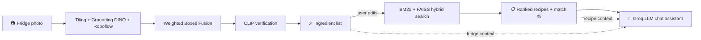

<div align="center">


<br/>


<br/>

> **Point your camera at your fridge. Get real ingredients, real recipes, and a real cooking assistant.**
> Detection → Verification → Hybrid Recipe Search → Context-Aware AI Chat

[](https://github.com/alio-elmotafy/Depi_project)
[](https://youtu.be/5J2FyAVwIpY)

</div>

---

## 🗂️ Table of Contents

- [📖 Overview](#-overview)
- [🧠 The AI, in Detail](#-the-ai-in-detail)
- [🧩 Pages Included](#-pages-included)
- [🚀 Features](#-features)
- [⚙️ Tech Stack](#️-tech-stack)
- [🛠️ How to Run Locally](#️-how-to-run-locally)
- [🔌 API Reference](#-api-reference)
- [📁 Project Structure](#-project-structure)
- [🎥 Demo](#-demo)
- [👥 Team](#-team)
- [🗺️ Roadmap](#️-roadmap)

---

## 📖 Overview

<table>
<tr>
<td width="58%">

**FRIDGO** turns a single photo of your fridge into a full cooking plan. Snap a picture, and the app detects what's actually inside, matches it against a recipe database, and hands you a conversational AI chef that can tweak any recipe on the spot — swap ingredients, adjust portions, make it vegetarian, whatever you need.

It's a static, responsive frontend (HTML/CSS/JS) backed by a Python/FastAPI AI service that does the heavy lifting: object detection, ingredient verification, hybrid recipe search, and LLM-powered chat.

</td>
<td width="42%" align="center">

```
Frontend     → Static HTML/CSS/JS
Backend      → FastAPI + Colab GPU
Detection    → Grounding DINO + Roboflow
Verification → CLIP (zero false positives)
Search       → BM25 + FAISS hybrid
Chat         → Groq LLM, context-aware
Endpoints    → /detect /recipes /chat
```

</td>
</tr>
</table>

---

## 🧠 The AI, in Detail

This isn't a single model calling itself "AI" — it's a small pipeline, and each stage exists to fix a specific weakness of the stage before it.

### 1. Ingredient Detection — "GOD-MODE V3" Vision Engine

<table>
<tr>
<td width="25%" align="center">

**🎯 Grounding DINO**
`grounding-dino-base`
Zero-shot, open-vocabulary detection by text prompt — no fixed label set needed

</td>
<td width="25%" align="center">

**🧊 Roboflow Model**
Custom fine-tuned detector specialized for fridge/kitchen items — cross-checks DINO

</td>
<td width="25%" align="center">

**🧩 WBF + Tiling**
Weighted Boxes Fusion merges overlapping detections; tiling catches small/hidden items

</td>
<td width="25%" align="center">

**✅ CLIP Verify**
`clip-vit-base-patch32`
Re-checks every candidate against a natural-language prompt before it reaches the user

</td>
</tr>
</table>

**Per-class confidence thresholds** are individually tuned — some items (milk cartons, cheese blocks) are naturally harder to detect than others, so every class gets its own bar to clear.

**Flow:** `photo → tiled multi-scale detection → WBF merge → CLIP re-verification → clean ingredient list`

<details>
<summary><b>📋 Click to expand — why each stage exists</b></summary>

<br/>

```
✦  Grounding DINO alone     → flexible but occasionally noisy on kitchen-specific items
✦  + Roboflow cross-check   → adds a specialist model trained specifically on fridge photos
✦  + WBF (not plain NMS)    → averages overlapping boxes instead of just deleting one,
                               producing tighter, more trustworthy boundaries
✦  + Tiling                 → a lemon behind a milk carton is easy to miss at full-image
                               scale; tiling gives the detector a "closer look" per region
✦  + CLIP verification      → the final gate — if the crop doesn't actually look like the
                               claimed ingredient in natural language terms, it's dropped
```

</details>

### 2. Recipe Matching — Hybrid Search

Once you have (and optionally edit) your ingredient list, FRIDGO doesn't just do a keyword lookup:

- **BM25** (`rank_bm25`) — classic lexical ranking, great at exact ingredient-name matches
- **Sentence-Transformers + FAISS** — semantic vector search, so "chicken breast" can still match a recipe calling for "poultry"
- The two signals are combined to rank recipes, and each result returns a real **match percentage** — literally *"what % of this recipe's own ingredients do you currently have?"* — as structured JSON, not text your frontend has to regex out of a markdown blob.

### 3. Conversational Recipe Assistant

- Powered by an **LLM via the Groq API** (fast Llama-family inference)
- The assistant is given your **live fridge inventory** *and* the specific **recipe you're viewing** as context, so it can answer things like *"can I make this without eggs?"* or *"double this for 6 people"* with answers grounded in what you actually have

### 4. Serving It All

- **FastAPI** backend exposing three endpoints, tunneled via **ngrok** (designed to run for free on a **Google Colab GPU runtime**, no dedicated server required)
- **CORS-enabled**, so the static frontend can be hosted anywhere and just point at whatever backend URL is currently live



---

## 🧩 Pages Included

<details open>
<summary><b>📄 Click to expand / collapse page list</b></summary>

| Page | Description |
|---|---|
| `pages/landing_page.html` | Hero landing page with feature highlights, demo button, and footer links |
| `pages/about_us.html` | Team and project story page |
| `pages/main_app_dashboard.html` | Main dashboard for image upload, ingredient detection, recipe suggestions, and AI chat |

</details>

---

## 🚀 Features

- 📸 **Drag-and-drop fridge photo upload**
- 🧠 **AI ingredient detection** — Grounding DINO + Roboflow + CLIP verification pipeline
- 🍳 **Smart recipe matching** — hybrid BM25/semantic search with real match percentages
- 💬 **Context-aware AI chat** — modify recipes conversationally, grounded in your actual fridge
- ✍️ **Manual ingredient add/remove**, always editable before searching
- 🎨 **Modern glassmorphism UI**, fully responsive
- 🔌 **Configurable backend** — swap the API URL at runtime, no rebuild needed

---

## ⚙️ Tech Stack

**Frontend**
- HTML5 · CSS3 · Vanilla JavaScript
- Google Fonts + Material Symbols
- Glassmorphism-style responsive design

**Backend / AI**
- FastAPI · Uvicorn · ngrok
- Grounding DINO · CLIP · Roboflow · `ensemble-boxes` (WBF) · `supervision`
- `sentence-transformers` · FAISS · `rank_bm25`
- Groq API (LLM inference) for the chat assistant
- PyTorch, runs on Google Colab (GPU recommended)

---

## 🛠️ How to Run Locally

### Frontend
1. Open `pages/landing_page.html` in your browser.
2. Use the **Detect** or **Get Started** button to open the dashboard.
3. Upload a fridge photo on `pages/main_app_dashboard.html`.
4. Click **Find Recipes** to call the backend and render suggestions.

> The dashboard expects a backend API URL. Set `window.__AETHERFRIDGE_API_URL__`, or store it in browser `localStorage` under `backendUrl`.

### Backend (Google Colab)
1. Open the backend notebook in Google Colab and set **Runtime → Change runtime type → GPU**.
2. Add your keys to Colab's **Secrets** panel (🔑 icon) with notebook access enabled:
   - `ROBOFLOW_API_KEY`
   - `NGROK_AUTH_TOKEN`
   - `GROQ_API_KEY`
3. Run the install cell, then the backend cell.
4. Copy the printed `https://xxxx.ngrok-free.app` URL into the frontend's backend URL field and click **Connect**.
5. Keep the Colab tab open — closing it ends the tunnel.

> ⚠️ **Security note:** never commit API keys/tokens to the repo or notebook cells. Use Colab Secrets or environment variables only, and rotate any key that may have been exposed.

---

## 🔌 API Reference

| Endpoint | Method | Description |
|---|---|---|
| `/api/detect` | `POST` | Upload a fridge photo → returns detected ingredients + annotated image |
| `/api/recipes` | `POST` | Send an ingredient list → returns ranked recipes with structured match data |
| `/api/chat` | `POST` | Send a message + fridge/recipe context → returns the assistant's reply |

---

## 📁 Project Structure

```
App/
├── css/
│   └── style.css
├── imgs/
│   └── logo.PNG
├── js/
│   └── script.js
├── pages/
│   ├── landing_page.html
│   ├── about_us.html
│   └── main_app_dashboard.html
└── README.md
```

---

## 🎥 Demo

https://github.com/user-attachments/assets/7ada48fd-e10c-4889-88d6-141154096836

Also available on [YouTube](https://youtu.be/5J2FyAVwIpY).

---

## 👥 Team

| Name | Role | LinkedIn |
|---|---|---|
| Eng. Alaa Samir | Supervisor | [Profile](https://www.linkedin.com/in/alaa-samir-ai) |
| Ahmed Ayman Elbamby | Team Leader | [Profile](https://www.linkedin.com/in/ahmed-elbamby/) |
| Ali Osama Ali | AI Engineer | [Profile](https://www.linkedin.com/in/ali-osama-240390274) |
| Salma Mohammed Hassan | AI Engineer | [Profile](https://www.linkedin.com/in/salma-m-h/) |
| Mohamed Emad Ahmed | AI Engineer | [Profile](https://www.linkedin.com/in/mohamed-emad-badr) |
| Mohamed Tareq Mahmoud | AI Engineer | [Profile](https://www.linkedin.com/in/mohammed-tarek-59824128b/) |
| Mohamed Reda Hashish | AI Engineer | [Profile](https://www.linkedin.com/in/mohamed-reda7) |

---

## 🗺️ Roadmap

- [ ] Nutritional breakdown per recipe
- [ ] Multi-photo fridge scanning (shelf-by-shelf)
- [ ] User accounts + saved inventories
- [ ] Mobile app wrapper

---

## 📌 Useful Links

- GitHub repo: [alio-elmotafy/Depi_project](https://github.com/alio-elmotafy/Depi_project)
- YouTube demo: [Watch here](https://youtu.be/5J2FyAVwIpY)

---

<div align="center">

*Built with 🧊 + 🧠 by the FRIDGO team*


</div>
